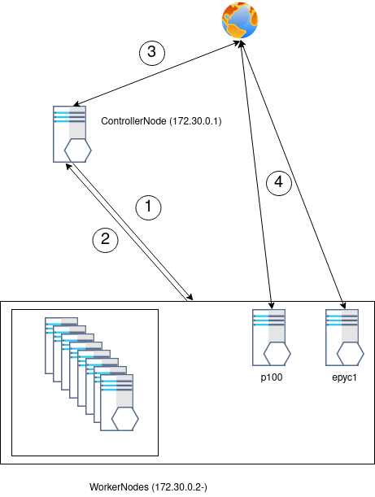

クラスターはControllerNodeとWorkerNodeからなり、[slurm](https://slurm.schedmd.com/documentation.html)によってジョブが実行される。

ControllerNodeはローカルip 172.30.0.1を持つ。

WorkerNodesはローカルip 172.30.0.2-を持つ。

1. 各ユーザーはControllerNodeの自分のアカウントにログインし、[slurmコマンド](https://slurm.schedmd.com/pdfs/summary.pdf)を実行することでジョブを投入する。ControllerNodeの```/archive```, ```/projects```はNSFによってWorkerNodesと共有される。実行プログラムを```/projects```に置き、実行結果を```/archive```に入れるようにする。WorkerNodeの秘密鍵を持つ。
2. WorkerNodeはslurmに渡されたジョブを実行する。すべてのWorkerNodeはssh公開鍵を共有し、```worker``` アカウントで作業をおこなう。

3. ControllerNodeはインターネットと接続しているが、WorkerNodesはインターネットから切断する。

4. p100, epyc1はクラスタ以外のユーザーも使うので、インターネットと接続している。

   

The cluster is composed of one ControllerNode and multiple WorkerNodes. Batch job is queued and executed by [slurm](https://slurm.schedmd.com/documentation.html).
ControllerNode has its local ip address 172.30.0.1. WorkerNodes have their local ip addresses 172.30.0.2-

1. Each user logs in to his/her account of ControllerNode. And throw jobs using [slurm commands](https://slurm.schedmd.com/pdfs/summary.pdf). Directories ```/archive``` and ```/projects``` are shared by NSF protocol among WorkerNodes. Put executable programs in ```/projects``` and let calculation results be in ```/archive```. ControllerNode has WorkerNodes' private key.
2. Each WorkerNode executes jobs those are given by slurm. WorkerNodes share the same ssh public key for account ```worker``` .

3. ControllerNode is connected to the Internet, but WorkerNodes not.
4. WorkerNodes p100 and epyc1 are used not only by the cluster. Therefore they have connections to the Internet.