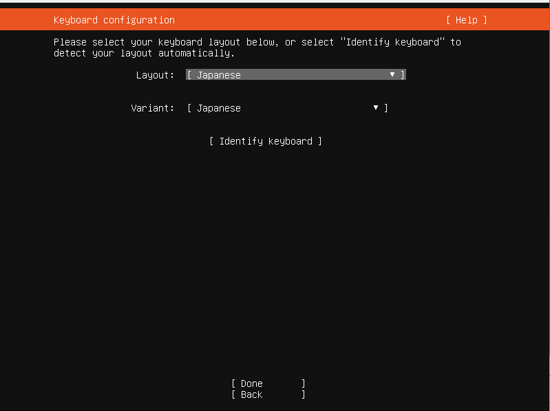

1. 準備 Preparation

   a. 最新の安定版ubuntu server のディスクイメージをダウンロードする
       Download latest stale ubuntu server install disc image.
   (e.g. https://releases.ubuntu.com/20.04.2/ubuntu-20.04.2-live-server-amd64.iso)

   b. ddコマンドによって、フォーマットしてよりusbメモリにディスクイメージを書き込む. 
       With ```dd``` command, write the disc image file into an erasable USB stick memory.

   c. マシンのマザーボードのNICはubuntuインストールメディアのドライバーに対応していないので、他のUSBポート等にLANアダプタを挿入し、そこからインターネットに接続する。
       As ubuntu installer does not have the driver for the network interface card on the motherboard, use usb-to-ethernet device to connect to the internet.

2. BIOS設定 Bios configuration
   a. マシンを起動し、BIOS設定を行う。大抵、起動時にF12キーあるいはDELキーを押し続けることでBIOS設定画面に入れる.
       Boot the machine and open BIOS configuration menu. When booting, press F12 or DEL key to enter the BIOS setting menu. (Read manual)
   
b. Wake On Lanを有効にする。マザーボードの説明書を参照。
       Activate Wake on LAN. Read manual
   
   c. save and exitを実行し、再起動する。
   
   ​    Save and exit to reboot.
   
3. インストール開始 Start installation
   a. インストールイメージを書き込んだUSBメモリをマシンに挿入
Insert the USB stick memory which we wrote the ubuntu installation media to.
   
b. マシンを起動し、インストールメディアからブートを行う。
   Boot the machine.
   
4. インストール
   a. 言語設定: English
   

   b. Keyboard configuration: Japanese
       

   c. Network connections: DHCPがうまく行っているならデフォルト
       

   d. Configure proxy: なし
       

   e. Configure Ubuntu archive mirror: デフォルト
       

   f. Guided storage configuration: Use an entire disk をチェックし、目標のSSDを設定
       Set up this disk as an LVM group のチェックを外す
       

   g. Storage configuration: Done
       

   h. Confirm destructive action: Continue

     
   i. Profile setup:
       Your name: worker
       Your server's name: Sect.0を参照
       Pick a username: worker
       Choose a password: password
       Confirm your password: password
       

   j. SSH Setup:
       Install OpenSSH serverにチェック
       Import SSH identity: No
       

   k. Featureed Server Snaps:
       すべてチェックなし

   ​    


​        l. USBメモリを抜いて再起動

　　　